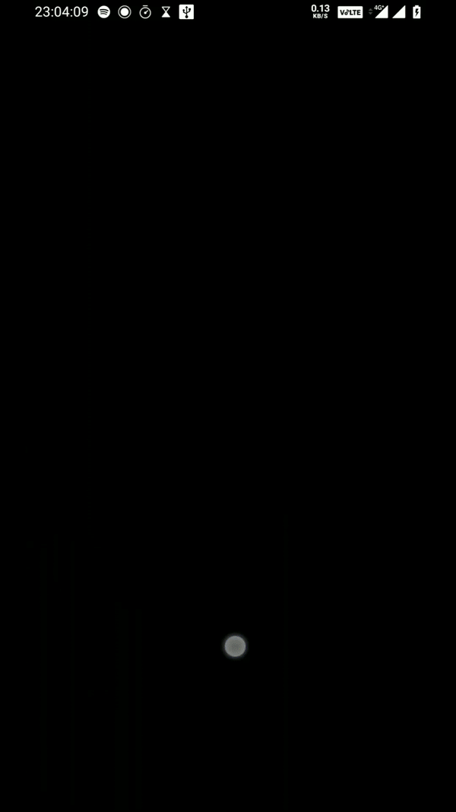

# Custom Progressbar - Using any gif file.
- This is a custom Progressbar where we can use any GIF file to use Progressbar in any android application.
- Using java language.

## 🚀 About Me
Hello there!

- I am A self-motivated (Self-Taught) and dedicated Software Developer(full stack) with excellent problem-solving skills and the ability to perform well in a team.
- Loves to learn by understanding and solving problems. I believe in learning and sharing knowledge and making good friends.

## Demo

## Built with

- JAVA [Language  for development](https://docs.oracle.com/en/java/)

    
    
 